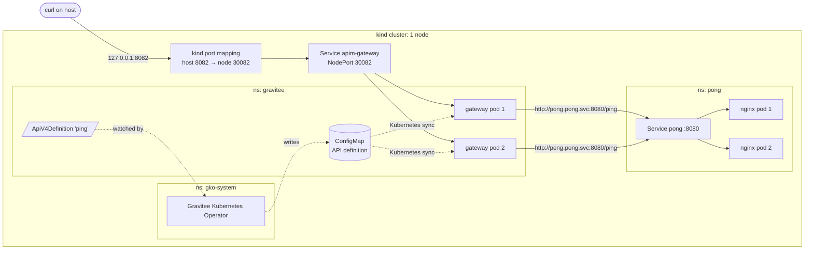

# Gravitee APIM on local Kubernetes: `GET /ping` → `pong`

A minimal Gravitee API Management stack on a local [kind](https://kind.sigs.k8s.io/) cluster.
The Gravitee gateway serves `GET /ping` and proxies it to a small backend that answers `pong`.

The gateway runs **DB-less**: there is no MongoDB, Management API or console. The API is a
Kubernetes resource (`ApiV4Definition`) in this repo. The Gravitee Kubernetes Operator (GKO)
turns it into gateway config, and the gateway loads it straight from Kubernetes.

```bash
make up      # create the cluster, deploy everything, run the smoke test
make test    # GET /ping through the gateway must return "pong"
make down    # delete everything
```

---

## Prerequisites

| Tool | Version used | Notes |
|---|---|---|
| Docker (Docker Desktop, Colima, OrbStack or Docker Engine) | Colima 0.10.3 / Docker 29 | Give it **4 CPUs / 6 GB RAM**. First run pulls ~1.3 GB of images. **Apple Silicon: enable Rosetta** (see below). |
| [kind](https://kind.sigs.k8s.io/docs/user/quick-start/#installation) | v0.33.0 | **≥ v0.24** is required: older kind does not enforce NetworkPolicies. |
| kubectl | v1.36 | |
| Helm | v4.2 and v3.20 | Both tested. Only flags common to Helm 3 and 4 are used (`--wait`, no `--atomic`). |
| make, bash, curl, openssl | any | Preinstalled on macOS. Minimal Linux servers may lack `make`: `sudo apt-get install -y make` (Debian/Ubuntu). |

Tested end-to-end on **macOS (Apple Silicon, arm64)** and **Linux (Ubuntu 22.04, x86_64)**,
both from a clean clone. See "What was tested" below.

> **Apple Silicon (arm64) note: Rosetta required.** Gravitee's `linux/arm64` operator
> image actually contains an **x86-64 binary** (checked on GKO 4.10 through 4.12.20), so it
> is CPU-emulated. Under qemu it segfaults at random, because qemu-user doesn't emulate
> x86 memory ordering. Under Rosetta it is stable. `make up` warns if Rosetta is off.
> - Colima: `colima start --cpu 4 --memory 6 --vm-type vz --vz-rosetta`
> - Docker Desktop: Settings → General → "Use Rosetta for x86_64/amd64 emulation"
> - OrbStack: on by default
>
> Linux/amd64 is not affected.

Install on macOS: `brew install kind kubectl helm colima docker`, then start Colima as above.
Install on Linux: see each tool's install page, or use your package manager.

Host port **8082** (on 127.0.0.1) must be free.

## Run it

```bash
git clone <this repo> && cd gravitee-apim-exercise
make up
```

`make up` is idempotent: running it again converges to the same state rather than failing
or duplicating anything. It takes about 3–5 minutes the first time, mostly image pulls.

### Test `/ping`

```bash
make test
# or by hand:
curl -i http://127.0.0.1:8082/ping
# HTTP/1.1 200 OK
# ...
# pong
```

`make test` checks both the status (200) and that the body is exactly `pong`.

### Look around

The cluster uses its own kubeconfig in `.kube/config`. Your `~/.kube/config` and current
context are never touched.

```bash
make status
export KUBECONFIG=$PWD/.kube/config
kubectl -n gravitee get apiv4definitions
kubectl -n gravitee get configmaps                      # includes the API definition the operator wrote
kubectl -n gravitee logs deploy/apim-gateway
```

Gateway metrics (Prometheus format) are on the technical API. The password is generated by
`make up` and stored in the gitignored `.secrets/` folder:

```bash
kubectl -n gravitee port-forward deploy/apim-gateway 18082:18082 &
curl -u admin:$(cat .secrets/gateway-techapi-password) http://127.0.0.1:18082/_node/metrics/prometheus
```

### Tear down

```bash
make down
```

This deletes the kind cluster (and every workload in it), `.kube/` and `.secrets/`.

---

## Architecture



**Configuration path (control plane):**
1. `kubectl apply` creates the `ApiV4Definition` named `ping` in the `gravitee` namespace.
2. GKO's admission webhook validates it, e.g. rejects a context path that is already used.
3. GKO reconciles it into a ConfigMap holding the gateway-format API definition.
4. Each gateway pod, with `services.sync.kubernetes.enabled`, watches ConfigMaps in its own
   namespace and deploys the API. No restart is needed.

**Request path (data plane):**
`curl 127.0.0.1:8082/ping` → kind port mapping → NodePort 30082 → a gateway pod → matches
the `/ping` listener and the keyless plan → proxies to `http://pong.pong.svc.cluster.local:8080/ping`
→ nginx returns `200 pong`.

### Repository layout

```
Makefile                  entry points: up / down / test / status
scripts/
  lib.sh                  shared settings: pinned versions, kubeconfig path, helpers
  up.sh                   ordered, idempotent install
  down.sh                 teardown
  test.sh                 smoke test with retries
cluster/kind-config.yaml  kind cluster: pinned node image, port mapping 127.0.0.1:8082
k8s/namespaces.yaml       namespaces + Pod Security Admission labels
helm/gko-values.yaml      Gravitee Kubernetes Operator values
helm/apim-values.yaml     Gravitee APIM values: gateway only, DB-less, hardened
k8s/backend/              pong backend (nginx) + its NetworkPolicies
k8s/gravitee/             the /ping ApiV4Definition + gateway NetworkPolicies
```

### Install order and why

| Step | What | Why this order |
|---|---|---|
| 1 | kind cluster | — |
| 2 | Namespaces | Pod Security labels must exist before any pod is created. |
| 3 | Technical API password | Generated once with `openssl rand`, kept outside Git, reused on re-runs. |
| 4 | GKO (Helm) | Installs the `ApiV4Definition` CRD and the webhook the API resource needs. |
| 5 | Wait for CRD `Established` | The operator creates its CRDs at startup, not through Helm. |
| 6 | APIM gateway (Helm) | `--wait` returns only when the startup probe (which includes the sync process) passes. |
| 7 | Backend | — |
| 8 | API + NetworkPolicies | Retried, because the webhook can need a few seconds after install. |
| 9 | Smoke test | Retries for up to 60 s while the gateway picks up the API. |

---

## Choices and alternatives

| Area | Choice | Alternatives considered | Why |
|---|---|---|---|
| Local cluster | **kind** | k3d, minikube | Runs the same on macOS and Linux with only Docker, supports a declarative config file, is pinned by image digest, and enforces NetworkPolicy since v0.24. k3d is equally good; minikube has more driver differences between OSes. |
| How the gateway gets its API config | **DB-less + GKO** | Classic stack: MongoDB + Management API + gateway, with the API created through the Management API (script or GKO with a ManagementContext) | Much smaller footprint (no MongoDB, no Management API JVM, no UIs). It is pure config-as-code: the API is a Kubernetes resource, versioned in Git and reconciled by an operator, with no imperative `curl` calls to create it. The trade-off is that there's no Console, Portal, subscriptions or analytics (see below). |
| Install method | **Official Helm charts**, versions pinned, fetched with `--repo` | Raw manifests, Kustomize, Terraform/Helmfile/Argo CD | Helm charts are Gravitee's supported path. `--repo` avoids changing the user's Helm repo list. In a real platform this would move to Argo CD/Flux (see next steps). |
| Backend | **nginx-unprivileged**, config in a ConfigMap | Custom Go/Python app, `hashicorp/http-echo` | No image to build or maintain. It returns exactly `pong` (http-echo adds a trailing newline). It runs non-root with a read-only root filesystem. |
| Entry point | **Makefile → bash scripts** | Taskfile, just, a single script | `make` exists on every macOS/Linux machine. The logic lives in scripts because macOS ships make 3.81 (no `.ONESHELL`) and bash 3.2; the scripts avoid newer bash features. |
| Exposure | **NodePort + kind port mapping on 127.0.0.1** | Ingress controller, `kubectl port-forward`, `cloud-provider-kind` LoadBalancer | Fewest moving parts that are reliable on both OSes. An ingress controller would add another component with little value for one route. |
| kubeconfig | **Project-local `.kube/config`** | Default `~/.kube/config` | Never changes the reviewer's current context, so `make` can't accidentally run against another cluster. |

### Production-grade settings applied

- **Pinned versions everywhere**: charts (4.12.20), images (gateway, operator, nginx), and the
  kind node image by digest. `imagePullPolicy: IfNotPresent`.
- **High availability**: 2 gateway and 2 backend replicas, `PodDisruptionBudget minAvailable: 1`,
  rolling updates with `maxUnavailable: 0`, and preferred pod anti-affinity across nodes.
- **Health**: startup, readiness and liveness probes on the gateway (from the chart, using the
  technical API) and on the backend (`/healthz`).
- **Resources**: requests on everything. Gateway memory limit = request (768Mi), so a pod is
  never OOM-killed for memory it was promised. The heap is sized from the container limit
  (`MaxRAMPercentage=60`). There is deliberately **no CPU limit on the gateway**: CFS
  throttling causes JVM latency spikes, and the request already guarantees its share.
- **Security**:
  - non-root, `allowPrivilegeEscalation: false`, all capabilities dropped, `RuntimeDefault` seccomp
  - read-only root filesystem on the backend
  - Pod Security Admission `restricted` **enforced** on the gateway and backend namespaces.
    Only `gko-system` stays on `baseline` (with `restricted` warn/audit), because the operator
    chart sets no `seccompProfile`
  - the backend's service account token is not mounted
- **Least-privilege RBAC**: the gateway's ServiceAccount has a namespaced Role (get/list/watch on
  ConfigMaps and Secrets in `gravitee` only). Gravitee's own reference DB-less setup uses a
  ClusterRole watching all namespaces. The operator only reconciles resources in `gravitee`.
- **Network isolation**: default-deny ingress in `gravitee` (only 8082 is open, and 18082
  only from a `monitoring` namespace). Default-deny ingress **and** egress in `pong`, which
  only accepts the gateway pods on 8080.
- **No default credentials**: the chart's technical API default password (`adminadmin`) is
  replaced by a random password generated at install time, never written to Git.
- **Graceful shutdown**: the gateway waits 10 s for in-flight requests before stopping
  (`terminationGracePeriod` 30 s).
- **Logging**: gateway log level set to INFO (the chart default is DEBUG). The operator logs in JSON.

---

## Assumptions

- **"Community Edition"** = the open-source Gravitee images and charts with no license
  key. DB-less mode and GKO are both available without a license.
- **"Whatever the gateway needs to get its API configuration"**: I read this as "the gateway
  must get its config from somewhere reproducible", not "must run MongoDB + Management API".
  DB-less with GKO satisfies that with fewer components. If the reviewers expect the full
  stack (Console, Portal), that's the first alternative listed above.
- **`GET /ping` is public**: a keyless plan, no authentication. Other HTTP methods are
  forwarded too, and the backend answers them with `405`.
- **The response body is exactly `pong`**, with no trailing newline.
- **Local only**: one kind node. HA settings (2 replicas, PDB, anti-affinity) are there so
  the config is ready for multiple nodes, even though they can't protect against a node
  failure here.
- **HTTP on localhost** is acceptable for the required part. TLS is covered under
  "What's missing".
- The reviewer's Docker has about 4 CPUs / 6 GB available, as stated in the brief.

---

## Optional items

| Item | Status |
|---|---|
| Elasticsearch / analytics | **Left out** to fit the resource budget and time box; the ES reporter is disabled explicitly. |
| Metrics endpoint | **Done.** Prometheus metrics at `:18082/_node/metrics/prometheus` (basic auth, password in the `gateway-techapi-credentials` Secret). Pods carry `prometheus.io/*` scrape annotations. |
| TLS with automatic renewal | **Not done** (time box). Plan below. |

### What I would watch

- **Traffic and errors**: request rate and 4xx/5xx ratio per API. Alert on the 5xx ratio
  (gateway or backend failures) and a sudden drop in traffic.
- **Latency**: p95/p99 gateway latency, separated into time spent in the gateway and time
  spent in the backend. That tells you which one is slow.
- **Backend health**: endpoint connection errors and timeouts (the gateway returning 502/504).
- **JVM**: heap used vs max, GC pause time, thread count. The gateway is a JVM (Vert.x), and
  heap pressure shows up here before an OOM-kill.
- **Pods**: restarts, OOM-kills, readiness flapping, CPU throttling, replicas available vs
  desired (PDB headroom).
- **Config sync**: whether every gateway pod has deployed the expected APIs, and the GKO
  reconcile error rate. A failed sync means old config keeps serving without anyone noticing.

---

## What's missing before production, and what I'd do next

In rough priority order:

1. **TLS.** Add cert-manager with a `ClusterIssuer` (ACME/Let's Encrypt, or an internal CA)
   and terminate TLS at an Ingress/Gateway API controller in front of the gateway, or at the
   gateway itself using a keystore from a `kubernetes.io/tls` Secret. cert-manager renews
   automatically. Locally this would use a self-signed CA issuer.
2. **Authentication on the API.** Replace the keyless plan with a JWT or API-key plan, and
   add rate limiting. Rate limiting needs a shared counter store (Redis), because in DB-less
   mode `ratelimit.type` is `none`.
3. **Technical API secret handling.** Today the generated password ends up in plain text in
   the gateway ConfigMap and in the probe headers, because the chart builds its probes from
   the value. Next step: use Gravitee's secret provider (`secret://kubernetes/...`) for the
   password, with custom probes, or keep the technical API unauthenticated on a port reachable
   only by the kubelet and Prometheus.
4. **Egress NetworkPolicy for the gateway.** It currently has unrestricted egress. It needs
   the backend, DNS and the Kubernetes API (for sync). The API server needs CIDR-based rules
   that depend on the cluster, so I left it out rather than ship a rule I couldn't verify on
   every machine.
5. **Autoscaling.** Enable the chart's HPA (min 2) once metrics-server is present, or use KEDA
   on request rate.
6. **GitOps.** Deliver the same Helm values and manifests with Argo CD or Flux instead of
   `make up`, with one values overlay per environment.
7. **Observability stack.** Prometheus Operator `PodMonitor` + dashboards + alerts for the
   signals above. Ship logs to Loki/ELK. Enable OpenTelemetry tracing on the gateway.
8. **Analytics.** If the business needs API analytics, add Elasticsearch/OpenSearch and the
   gateway reporter, or the full Management API + Console for API owners (which brings
   MongoDB back).
9. **Supply chain.** Mirror images to a private registry, pin by digest, scan with Trivy,
   verify signatures. Add CI that runs `helm template`, kubeconform and kube-linter, then
   `make up && make test` on a kind cluster.
10. **Pod Security `restricted` for the operator** (the chart needs a `seccompProfile` option
    or a post-renderer), and a read-only root filesystem for the gateway with emptyDir mounts
    for its writable paths.
11. **Operator hardening.** Namespaced-only RBAC where GKO supports it, a NetworkPolicy that
    still lets the API server reach the webhook, and 2 operator replicas with leader election.

## What was tested

**Linux:** Ubuntu 22.04.3 x86_64, Docker 29.3.1, kind v0.33.0, Helm v3.20, kubectl v1.35, from a
fresh `git clone`. `make up` passed in 146 s, a second `make up` converged, and `GET /ping`
returned `200` with body `pong`. The operator is stable on native x86 (one restart at startup,
see "Issues found" #5), and `make down` left no containers behind.

**macOS:** macOS 26 (Apple Silicon), Colima 0.10.3 (vz + Rosetta, 4 CPU / 6 GB), kind v0.33.0,
Helm v4.2. The full set of checks:

| Check | Result |
|---|---|
| `make down` then `make up` from nothing | passes in ~3.5 min (first image pull included) |
| `make up` run a second time | converges, `/ping` still `pong` |
| `GET /ping` | `200`, body exactly `pong` (4 bytes), `X-Gravitee-*` headers present (served by the gateway) |
| `POST /ping`, `GET /nope` | `405` (from the backend), `404` (gateway: no matching API) |
| Pod in `default` namespace → backend directly | blocked (curl timeout, packets dropped by NetworkPolicy) |
| Pod with gateway labels → backend | `pong` (positive control: the policy allows the gateway) |
| Metrics without / with the password | `401` / `200` with `http_server_requests_total`, `jvm_*` |
| Gateway pods under PSA `restricted` enforce | admitted |
| Rolling restart of the gateway | `/ping` kept serving (maxUnavailable 0) |
| Memory used by the whole kind node | ~1.6 GB |

## Issues found while building (and how they were handled)

These cost the most time, and they are worth knowing about if you run GKO in DB-less mode:

1. **An API without `definitionContext.syncFrom: KUBERNETES` is silently ignored.** GKO
   defaults to `syncFrom: MANAGEMENT`. With no ManagementContext it then marks the resource
   "Successfully reconciled" but never writes the ConfigMap, so the gateway returns `404`.
   Found by reading `createOrUpdateV4` in the GKO 4.12.20 source. Fixed in
   `k8s/gravitee/api-ping.yaml`.
2. **The GKO template engine crashes the operator** (`fatal error: concurrent map writes`)
   when its mutating and validating webhooks run at the same time. This setup uses no `[[ ]]`
   templating, so `manager.templating.enabled: false`.
3. **`checkApiContextPathConflictInCluster: true` breaks a namespace-scoped operator.** The
   webhook needs cluster-wide `list` on `apidefinitions` and rejects every API. Left at the
   default (`false`); conflicts are still checked inside the watched namespace.
4. **The arm64 operator image contains an x86-64 binary** (see the Apple Silicon note above).
5. The operator restarts once on first install because its webhook certificate isn't mounted
   yet. It recovers by itself; this is harmless.

## Troubleshooting

| Symptom | Check |
|---|---|
| `make up` fails at "Docker is not running" | Start your Docker runtime. |
| Port 8082 already in use | Free it, or change `hostPort` in `cluster/kind-config.yaml` and `GATEWAY_URL` (`GATEWAY_URL=... make test`). |
| Gateway pods stuck in startup | `kubectl -n gravitee describe pod -l app.kubernetes.io/component=gateway`. Usually too little memory for Docker. |
| `/ping` returns 404 | Check `definitionContext.syncFrom: KUBERNETES` is set, then that the API synced: `kubectl -n gravitee get apiv4definitions ping -o yaml` (status) and `kubectl -n gko-system logs deploy/gko-controller-manager`. |
| `/ping` returns 502/504 | Backend or NetworkPolicy: `kubectl -n pong get pods`, and check the gateway pod labels match `k8s/backend/networkpolicies.yaml`. |

## Resource usage

Requested: gateway 2 × 768Mi, operator 128Mi, backend 2 × 16Mi, plus the kind control
plane. Measured: **~1.6 GB of memory for the whole node, ~13% CPU at idle, 1.3 GB of images**,
well inside the brief's 4 CPUs / 6 GB.
